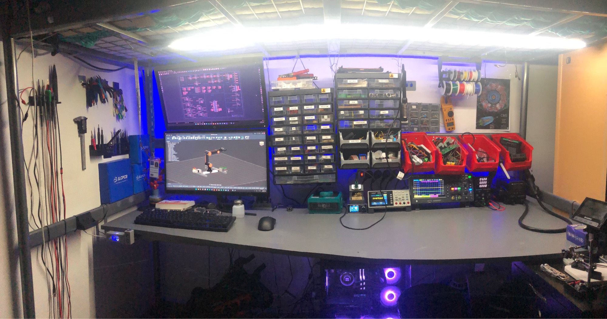

# 🔬 The Lab

> Where everything I build gets designed, soldered, measured and broken. A home electronics lab built up piece by piece since I started — and still growing.

---

## 🧰 Test & measurement

| Instrument | Model | What I use it for |
|---|---|---|
| **Oscilloscope** | Hantek DSO2D15 | Debugging basically everything — and it has a built-in AWG, so it's two instruments in one |
| **Bench multimeter** | OWON XDM1041 (55,000 counts) | Precise measurements without another handheld cluttering the desk |
| **Bench power supply** | Jesverty 30 V / 10 A | Low ripple, precise, and it runs anything I need to test |
| **LCR meter** | FNIRSI LC1020E | High-precision component characterisation |
| **Logic analyser** | Alientek DL16 — 250 MHz, 16 ch | Serious digital debugging (I²C, UART, SPI) |
| **Logic analyser** | 24 MHz, 8 ch | The cheap one that started it all — still handy for quick captures |

*The logic analysers earned their place during the [I²C stress test on my robotic arm](https://github.com/jenatton-Malik/5dof-robotic-arm) — hunting for NACKs on a 1.3 m bus wrapped around a running stepper.*

---

## 🔥 Soldering & rework

| Tool | Model | Notes |
|---|---|---|
| **Soldering iron** | Geeboon TC22 | Hits temperature in ~2 s, dead accurate, cheap tips, hundreds of tip profiles available |
| **Hot air station** | Toolcraft ZD8908 | SMD rework and desoldering |
| **Fume extractor** | YIHUA 948 Q I | Because breathing flux fumes all evening is a bad plan |

---

## 🖨️ 3D printing

**Creality K1 SE — heavily modified**

Fitted with a custom plexiglass enclosure and a **temperature control system I designed and built myself**:

- ESP32 + LCD + NTC thermistor + MOSFET, powered by a 24 V → 5 V buck converter
- A web interface to monitor chamber temperature and set a target
- Simple hysteresis logic: above target + 1 °C the extraction fan runs at 100 %, down to target − 1 °C

**Custom-built printer** — based on a Geeetech A10M dual extruder

Rebuilt from the ground up into a large ventilated enclosure (plexiglass + 2020 aluminium extrusion), running **Klipper on a Raspberry Pi 3**.

**Filament dryer** — Sunlu

---

## 🖥️ Homelab server

| | |
|---|---|
| **CPU** | Intel i7-4770 |
| **RAM** | 32 GB DDR3 |
| **GPU** | RTX 3060 12 GB |
| **Storage** | 10 TB HDD + 256 GB SSD (OS) |

Runs local LLMs and AI agents on the GPU, alongside Nextcloud, a NAS, Paperless and Pi-hole.

---

## 📈 How it grew

This didn't appear overnight. It started with a couple of red bins, one bench supply and a single monitor.

*(dated photos coming here — the lab through the years)*

---

## 🗺️ What's next

- [ ] *(add wishlist items as they come)*
